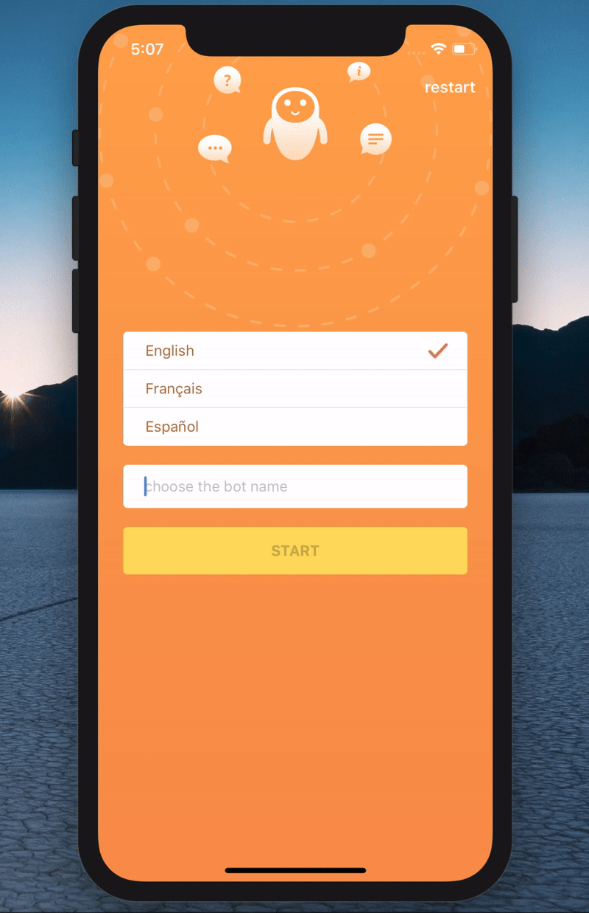

[](https://travis-ci.org/RxSwiftCommunity/RxLocalizer)
[](https://github.com/RxSwiftCommunity/RxLocalizer)
[](https://github.com/ReactiveX/RxSwift)
[](https://github.com/RxSwiftCommunity/RxLocalizer/blob/master/LICENSE)
[](https://github.com/RxSwiftCommunity/RxLocalizer/blob/master/LICENSE)

# RxLocalizer

RxLocalizer is a framework written in swift which allows you to localize your apps, using RxSwift. 

<p align="center">

## Requirements

- Xcode 11.4
- Swift 5.2+
- iOS 10+

## Installation

### Swift Package Manager (requires Xcode 11)

Add package into Project settings -> Swift Packages

### CocoaPods

```ruby
pod 'RxLocalizer'
```

## Usage

### Before all:

```swift
import RxLocalizer
```

### Reactive localized strings

```swift
Localizer.shared.localized("Start")
.drive(startLabel.rx.text)
.disposed(by: disposeBag)
```

### Synchronously localized strings

```swift
startLabel.text = Localizer.shared.localized("Start")
```

### Change language

You are able to set language by language code. 
A full list of the codes you can check [here](https://www.ibabbleon.com/iOS-Language-Codes-ISO-639.html).
```swift
Localizer.shared.changeLanguage.accept("en")
```

### Change RxLocalizer configuration

You are able to change default configuration, using `changeConfiguration` property.

```swift
let localizerConfig = LocalizerConfig(defaults: .standard, bundle: .main, tableName: "Localizable")
Localizer.shared.changeConfiguration.accept(localizerConfig)
```

## License

RxLocalizer is available under the MIT license. See the LICENSE file for more info.
Copyright (c) RxSwiftCommunity
